# Git初始化及仓库创建和操作
- 基本信息设置
> 1. 设置用户名  
> 使用命令行 ``` git config --global user.name 'github用户名' ```  
> 2. 设置用户名邮箱  
>使用命令行 ``` git config --global user.email 'github邮箱' ```
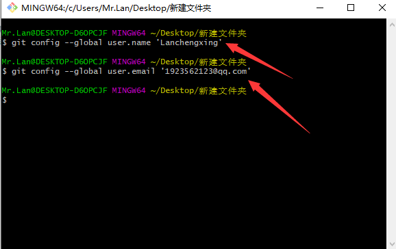
---
- 初始化一个新的Git仓库
> 1. 创建文件夹  
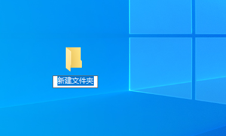
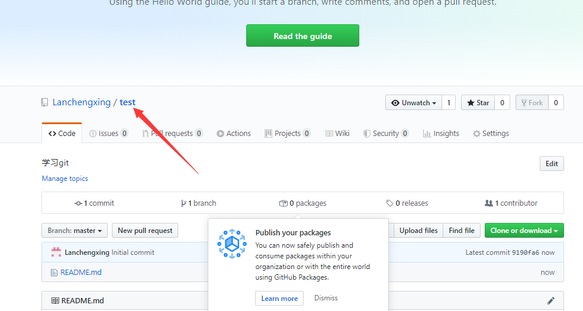
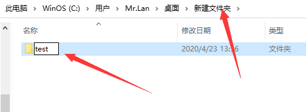
> 2. 在文件内初始化git(创建git仓库)  
> 使用命令行 ``` git init ```
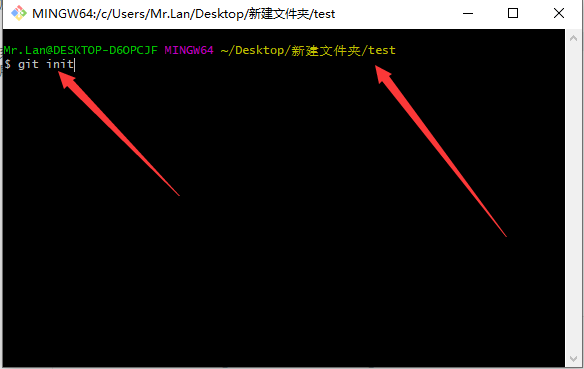  
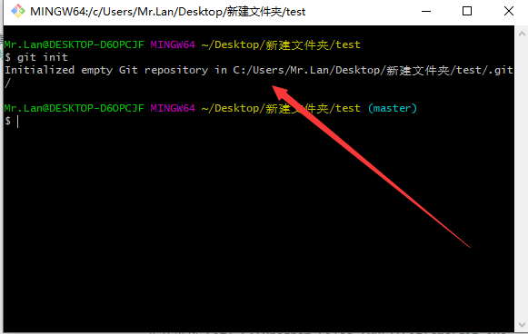
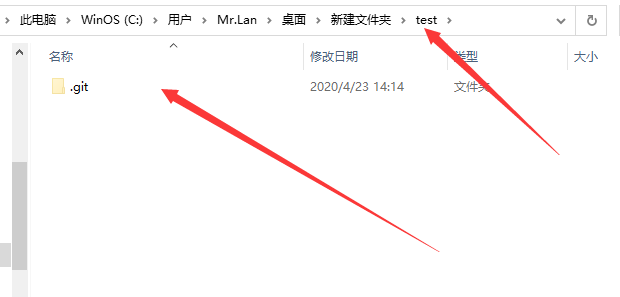
---
- 向仓库添加文件  
> 1. 创建新文件  
> 使用命令行 ``` touch 文件名 ``` 右击新建也行  
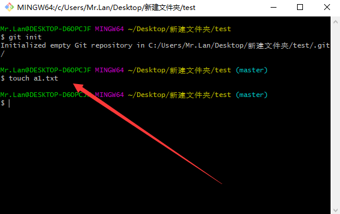
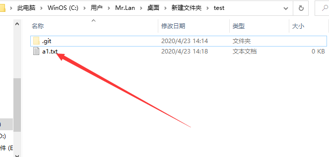
> 2. 把文件添加到暂存区  
> 使用命令行 ``` git add a1.txt ```  
> 查询状态 ``` git status ```  
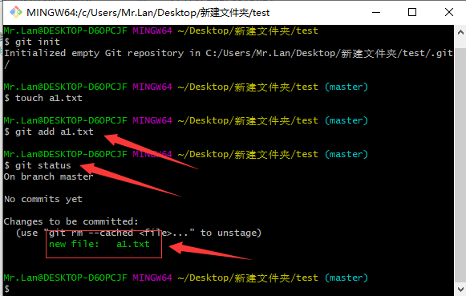
> 3. 把暂存区的文件提交到仓库  
> 使用命令行 ``` git commit -m 'add a1.txt' ```  
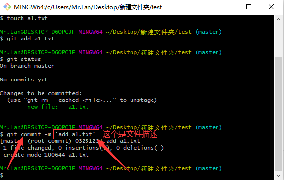  
> 4. 查看是否提交成功  
> 使用命令行 ``` git status ``` 
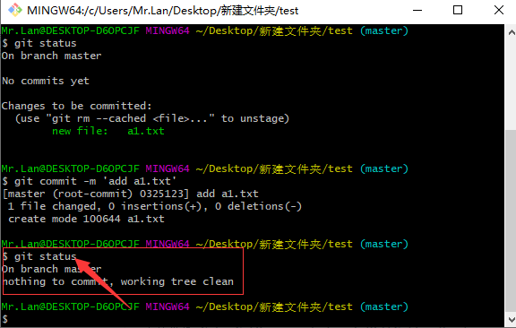
---
-  修改仓库文件  
> 1. 先查看有的文件  
> 使用命令行 `` ls ``   
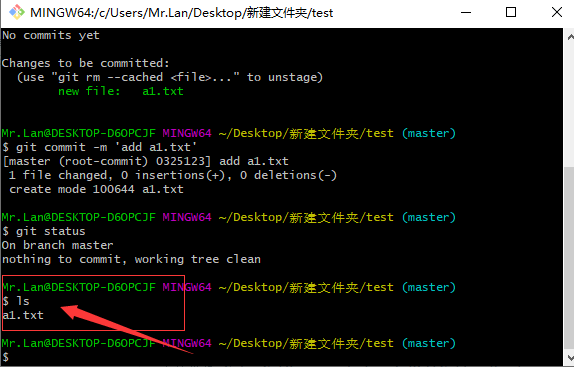
> 2. 选中文件  
> 使用命令行 ``` vi a1.txt ```  
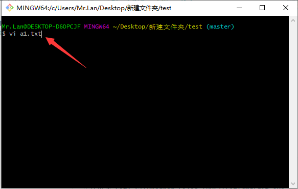
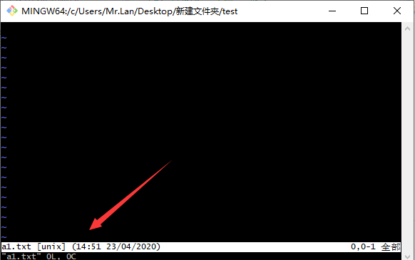
> 3. 读取文件  
> 使用命令行 ``` cat al.txt ```  
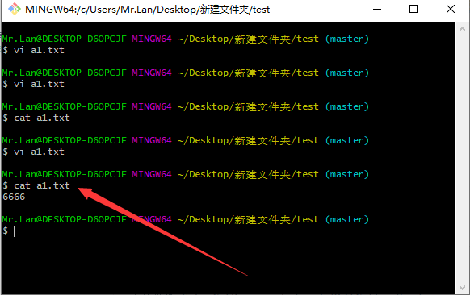
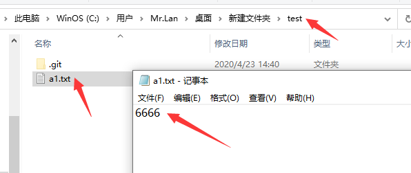
> 4. 查看状态  
> 使用命令行 ``` git status ```  
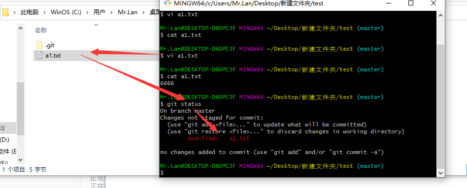
> 也可以直接在txt里添加修改,再查看状态  
---
- 再把工作区的文件添加到暂存区，然后把暂存区的文件提交到仓库  
> 1. 把工作区的文件添加到暂存区  
> 使用命令行 ``` git add a1.txt ```  
> 查询状态 ``` git status ```  
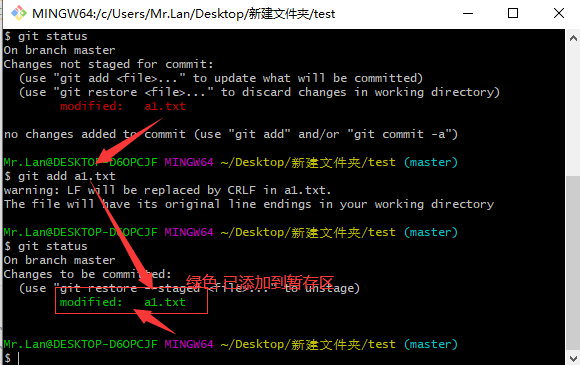  
> 2. 把暂存区的文件提交到仓库  
> 使用命令行 ``` git commit -m '第一次通过git修改文件到仓库' ```  
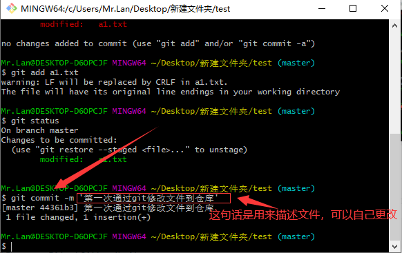  
> 3. 再次查询状态  
> 使用命令行 ``` git status ```  
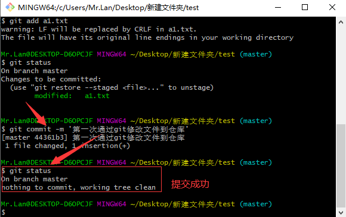
---
- 删除仓库文件
> 1. 删除文件(工作区的文件)    
> 使用命令行 ```rm -f a1.txt ```    
> 也可以通过鼠标右击删除  
> 2. 删除文件(暂存区的文件)  
> 使用命令行 ```git rm a1.txt ```  
> 3. 删除仓库文件(提交操作)  
> 通过命令行 ```git commit -m '提交描述' ```  
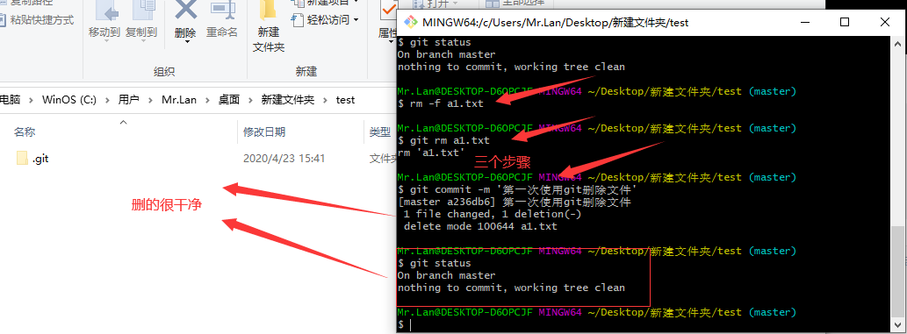