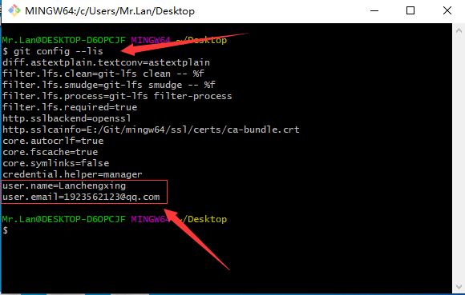
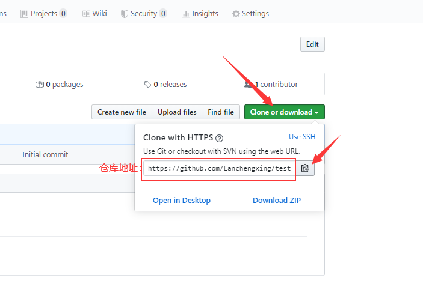
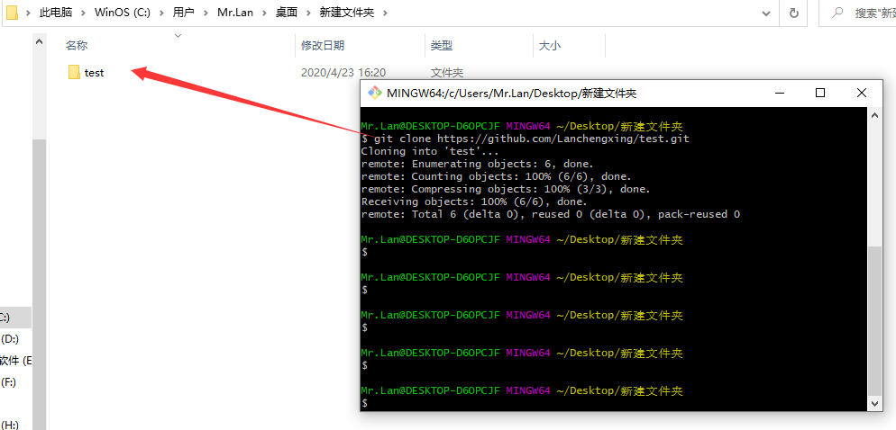
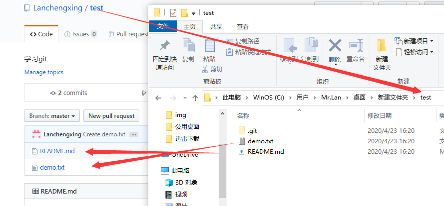
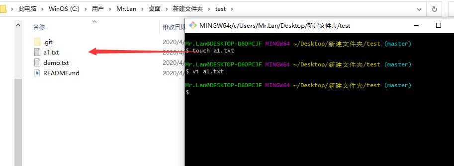
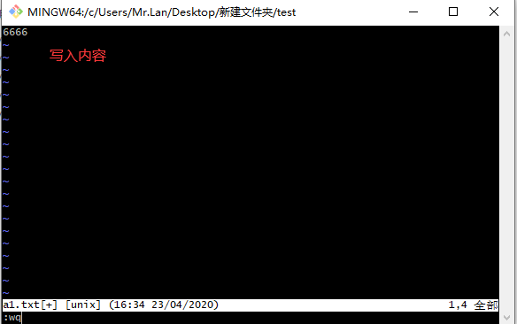
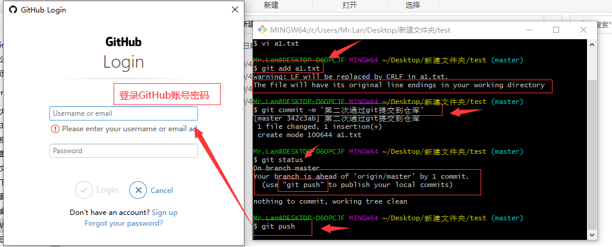
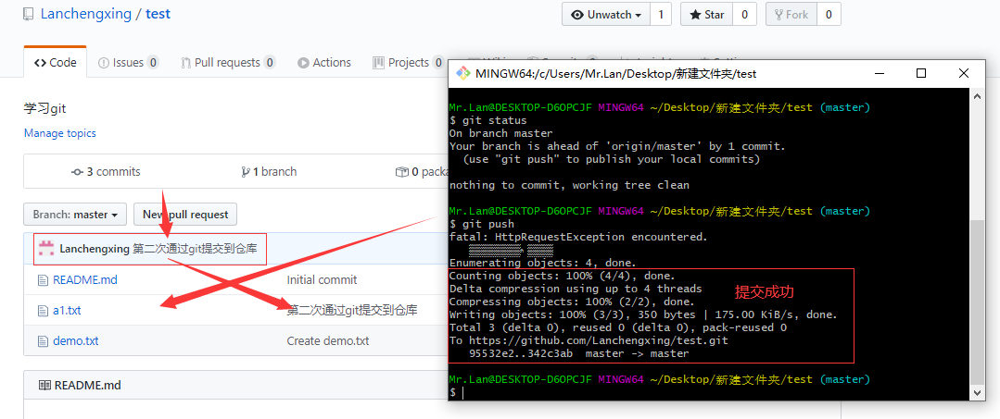

# Git管理远程仓库
- 克隆操作（这是第一步）  
  + 目的是将远程仓库（gitgub对应的项目）复制到本地  
> 1. 使用命令行 ``` git clone 仓库地址 ```   
***补充：如何查看是否已初始化***  
> 使用命令行 ``` git config --lis ```  
> 一般初始化化一次就会有记录了  
  
*仓库地址:*  
  
*接下来进行克隆操作*  
> 使用命令行 ``` git clone 仓库地址 ```  
  
  
---
- 修改文件内容(要在对应文件夹内)  
> 使用命令行创建新文件 ``` touch 文件名与类型 ```  
> 使用命令行修改文件 ``` vi 要修改的文件 ```  
  
  
---
- 提交文件  
  + 先将工作区的文件添加到暂存区，再把暂存区的文件提交到本地仓库，然后把本地仓库的文件同步到远程仓库  
> 通过命令行操作  
> 1. 将工作区的文件添加到暂存区  
> 使用命令行 ``` git add a1.txt ```   
> 2. 暂存区的文件提交到本地仓库  
> 使用命令行 ``` git commit -m '文件描述' ```   
> 使用命令行 ``` git status ```  (用来查看状态)    
> 3. 把本地仓库的文件同步到远程仓库  
> 使用命令行 ``` git push ```  
  
  